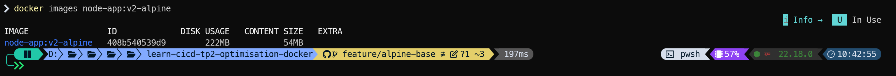
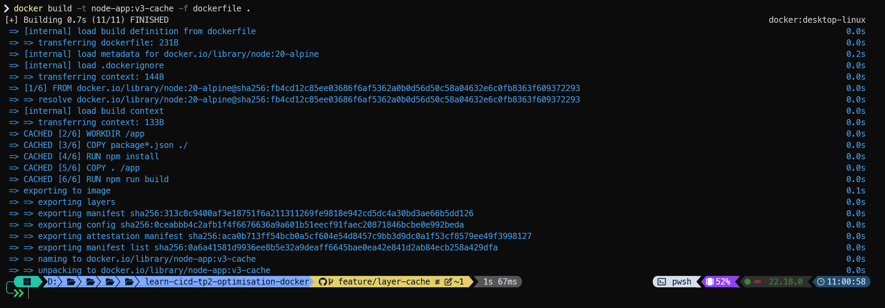
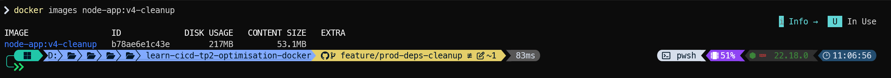

# TP Optimisation Docker

## Tableau Comparatif des Optimisations

| Étape | Tag de l'image | Taille (Disk Usage) | Content Size | Réduction vs Baseline | Temps de Rebuild | Description de l'optimisation |
| :--- | :--- | :--- | :--- | :--- | :--- | :--- |
| **0. Baseline** | `node-app:v0-baseline` | **1.92 GB** | 482 MB | - | ~61.1s | Image initiale non optimisée fournie dans le TP |
| **1. Dockerignore** | `node-app:v1-dockerignore` | **1.93 GB** | 484 MB | - | ~16.5s | Ajout du `.dockerignore` et filtrage du contexte de build |
| **2. Alpine Base** | `node-app:v2-alpine` | **222 MB** | - | -88.5% (~1.71 GB) | ~16.1s | Passage à `node:20-alpine` et suppression des paquets Debian |
| **3. Layer Caching** | `node-app:v3-cache` | **222 MB** | - | -88.5% (~1.71 GB) | **0.7s (Cache Hit)** | Réorganisation des couches pour exploiter le cache Docker |
| **4. Production & Sec** | `node-app:v4-cleanup` | **217 MB** | **53.1 MB** | **-88.7% (~1.70 GB)** | ~1.5s | Exclusion des `devDependencies` (`npm ci --only=production`), utilisateur non-root `node` |

---

## Détails par Étape

### Étape 0 : État Initial (Baseline)

* **Objectif** : Mesurer la taille initiale de l'application sans modification.
* **Résultat** : Taille de l'image : **1.92 GB** (Content Size : 482 MB).
* **Preuve** :

### Étape 1 : Isolation du contexte avec `.dockerignore`

* **Problème identifié** : L'envoi inutile de fichiers lourds (`node_modules` local, documentation, historique Git) saturait le contexte de build (10.69 MB) et provoquait des temps de transfert élevés. De plus, la directive `COPY node_modules` copiait des dépendances dépendantes de l'OS hôte.
* **Solution appliquée** :
  1. Création d'un fichier `.dockerignore` pour filtrer les artefacts locaux (`node_modules`, `.git`, `docs`).
  2. Suppression de la ligne `COPY node_modules ./node_modules` dans le `dockerfile` pour laisser `npm install` installer proprement les paquets Linux[cite: 2, 3].
* **Impact & Analyse** :
  * Le contexte envoyé au démon passe de **10.69 MB à 46.63 KB**.
  * Le temps de build est divisé par près de 4 (de **61.1s à 16.5s**).
  * La taille finale reste similaire (~1.93 GB) car l'image de base reste `node:latest` et les dépendances système inutiles (`build-essential`) sont toujours installées[cite: 2, 3].
* **Preuve** :

### Étape 2 : Migration vers une image de base légère (Alpine)

* **Problème identifié** : L'image de départ utilisait `node:latest` (basée sur une distribution Debian complète de plus de 1 GB) combinée à l'installation inutile d'outils de compilation C++ (`build-essential`) non requis en production.
* **Solution appliquée** :
  1. Remplacement de `node:latest` par `node:20-alpine` (système minimaliste de quelques mégaoctets).
  2. Suppression des commandes Debian incompatibles et superflues (`apt-get install -y build-essential...`)[cite: 3].
* **Impact & Analyse** :
  * La taille de l'image chute drastiquement de **1.93 GB à 222 MB** (gain de **~1.71 GB**).
  * La surface d'attaque en matière de sécurité est considérablement réduite grâce à la suppression de centaines de binaires et utilitaires système superflus.
* **Preuve** :

### Étape 3 : Optimisation du cache des couches (Layer Caching)

* **Problème identifié** : La directive `COPY . /app` était placée avant `RUN npm install`. À chaque modification d'un fichier source, la couche de copie changeait, invalidant complètement le cache Docker et forçant une réinstallation complète des dépendances.
* **Solution appliquée** :
  1. Séparation de la copie des métadonnées de dépendances (`COPY package*.json ./`).
  2. Exécution de l'installation (`RUN npm install`) avant de copier le reste du code.
  3. Copie du code source applicatif (`COPY . /app`).
* **Impact & Analyse** :
  * Lors d'une modification du code source applicatif sans changement des dépendances, la couche d'installation est récupérée instantanément du cache (`CACHED`).
  * Le temps de build chute drastiquement de **16.1s à 0.7s**.
* **Preuve** :

### Étape 4 : Dépendances de Production et Sécurité (Non-root)

* **Problèmes identifiés** :
  1. L'application incluait des dépendances de développement inutiles en production (ex. outils de dev, nodemon).
  2. Le conteneur s'exécutait avec les privilèges administrateur `root` (`USER root`), posant un risque majeur de sécurité et d'évasion de conteneur.
  3. Présence de scripts redondants (`RUN npm run build`) et de ports déclarés inutilisés (`EXPOSE 4000 5000`).
* **Solutions appliquées** :
  1. Utilisation de `ENV NODE_ENV=production` et `RUN npm ci --only=production` pour n'installer que le strict nécessaire à l'exécution.
  2. Remplacement de l'utilisateur par l'utilisateur système standard sans privilèges `USER node`.
  3. Nettoyage des directives mortes (`npm run build` supprimé) et restriction du port exposé au seul port réellement utilisé (`EXPOSE 3000`).
* **Impact & Analyse** :
  * Le **Content Size** chute de **484 MB à 53.1 MB**, prouvant l'éradication des dépendances superflues.
  * La surface de vulnérabilité est minimisée grâce à l'exécution sous l'utilisateur non-privilégié `node` et la fermeture des ports superflus.
* **Preuve** :

