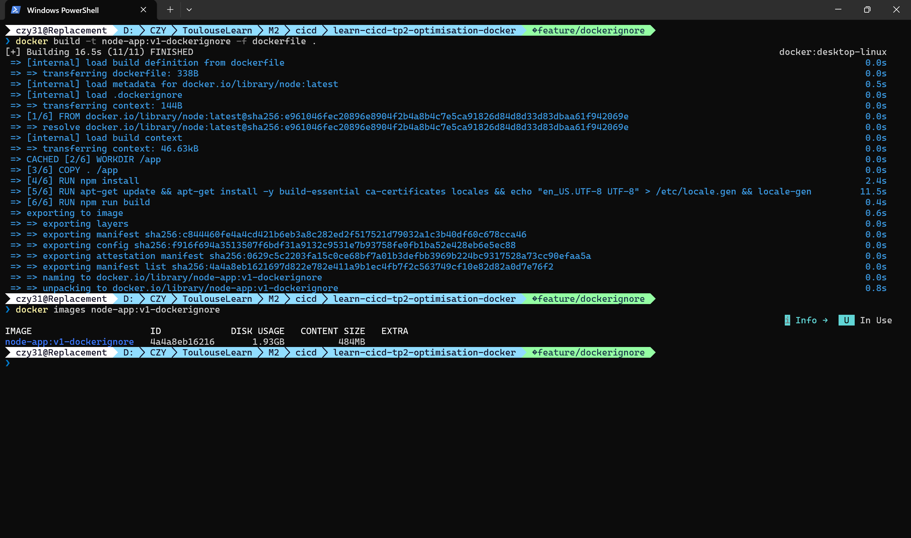

# TP Optimisation Docker

## Tableau Comparatif des Optimisations

| Étape               | Tag de l'image             | Taille (Disk Usage) | Temps de Build | Contexte Envoyé | Description de l'optimisation                                  |
|:------------------- |:-------------------------- |:------------------- |:-------------- |:--------------- |:-------------------------------------------------------------- |
| **0. Baseline**     | `node-app:v0-baseline`     | **1.92 GB**         | ~61.1s         | 10.69 MB        | Image initiale non optimisée                                   |
| **1. Dockerignore** | `node-app:v1-dockerignore` | **1.93 GB**         | **~16.5s**     | **46.63 KB**    | Ajout du `.dockerignore` et suppression du `COPY node_modules` |

---

## Détails par Étape

### Étape 0 : État Initial (Baseline)

* **Objectif** : Mesurer la taille initiale de l'application sans modification.
* **Résultat** : Taille de l'image : **1.92 GB** (Content Size : 482 MB).
* **Preuve** :

### Étape 1 : Isolation du contexte avec `.dockerignore`

* **Problème identifié** : L'envoi inutile de fichiers lourds (`node_modules` local, documentation, historique Git) saturait le contexte de build (10.69 MB) et provoquait des temps de transfert élevés. De plus, la directive `COPY node_modules` copiait des dépendances dépendantes de l'OS hôte.
* **Solution appliquée** :
  1. Création d'un fichier `.dockerignore` pour filtrer les artefacts locaux (`node_modules`, `.git`, `docs`).
  2. Suppression de la ligne `COPY node_modules ./node_modules` dans le `dockerfile` pour laisser `npm install` installer proprement les paquets Linux[cite: 2, 3].
* **Impact & Analyse** :
  * Le contexte envoyé au démon passe de **10.69 MB à 46.63 KB**.
  * Le temps de build est divisé par près de 4 (de **61.1s à 16.5s**).
  * La taille finale reste similaire (~1.93 GB) car l'image de base reste `node:latest` et les dépendances système inutiles (`build-essential`) sont toujours installées[cite: 2, 3].
* **Preuve** :

