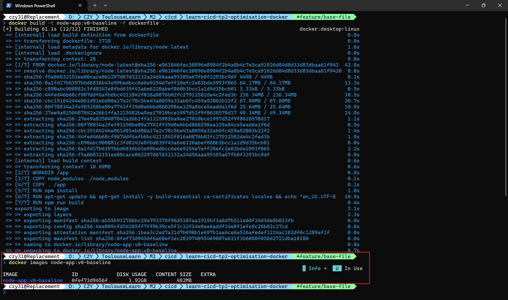

# TP Optimisation Docker

## Tableau Comparatif des Optimisations

| Étape           | Tag de l'image         | Taille (Disk Usage) | Réduction vs Baseline | Description de l'optimisation                   |
|:--------------- |:---------------------- |:------------------- |:--------------------- |:----------------------------------------------- |
| **0. Baseline** | `node-app:v0-baseline` | **1.92 GB**         | -                     | Image initiale non optimisée fournie dans le TP |

---

## Détails par Étape

### Étape 0 : État Initial (Baseline)

* **Objectif** : Mesurer la taille initiale de l'application sans modification.
* **Résultat** : Taille de l'image : **1.92 GB** (Content Size : 482 MB).
* **Preuve** :

